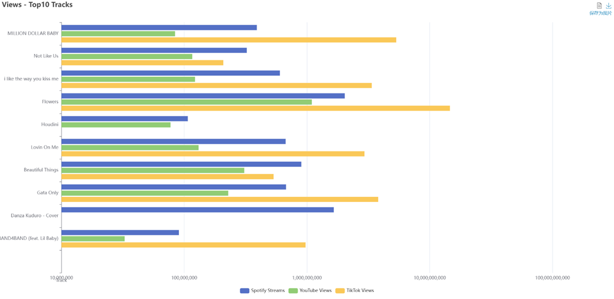
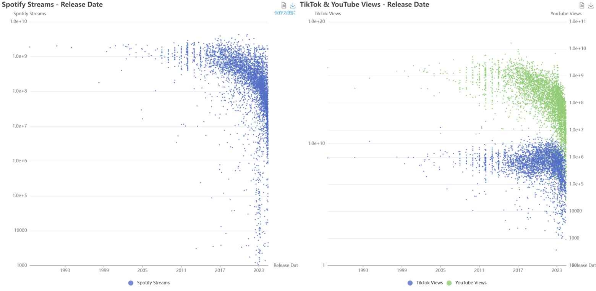
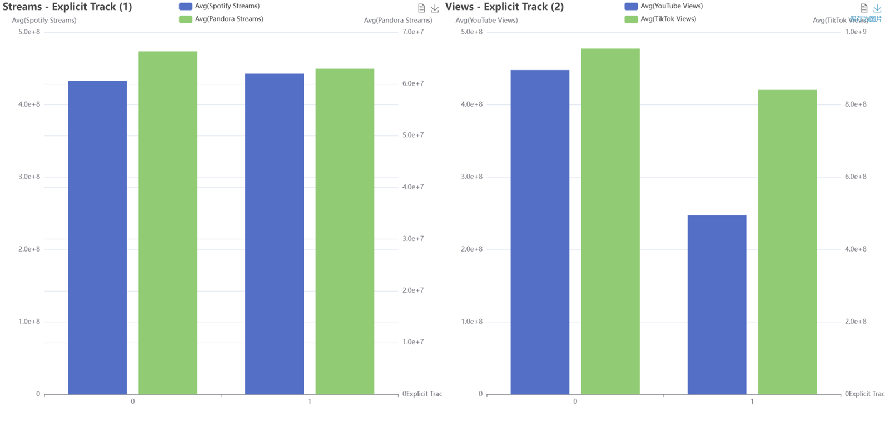
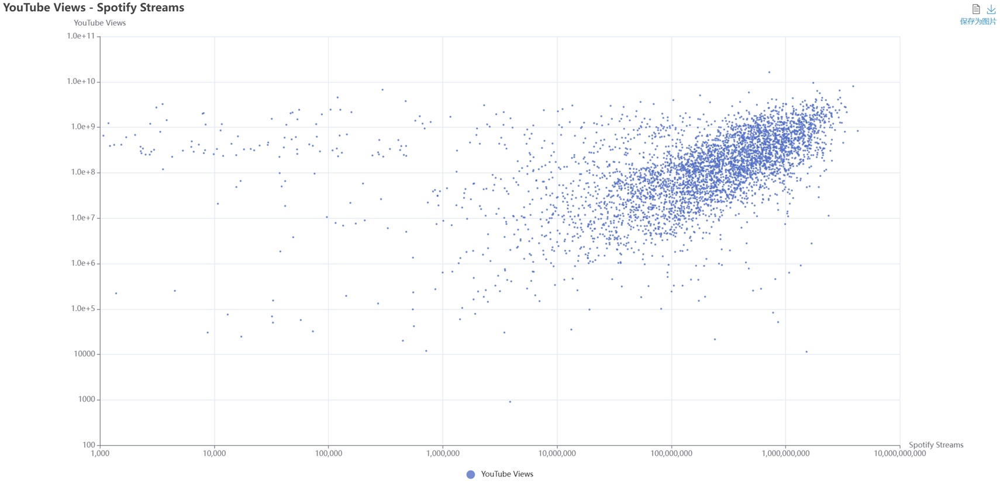
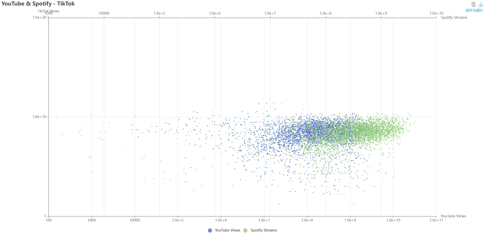
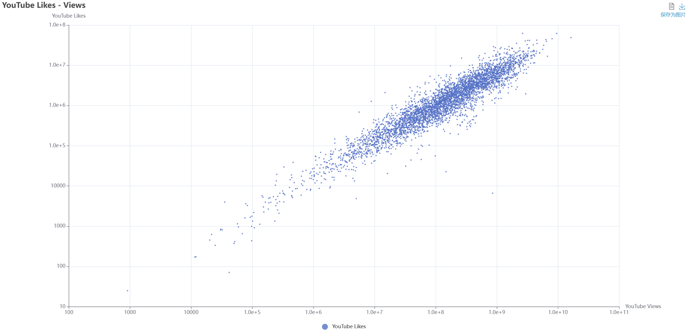
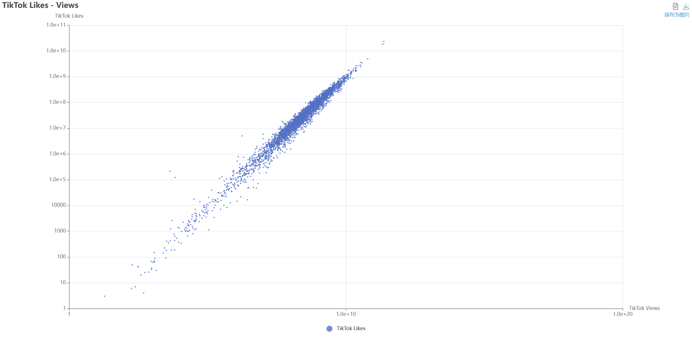
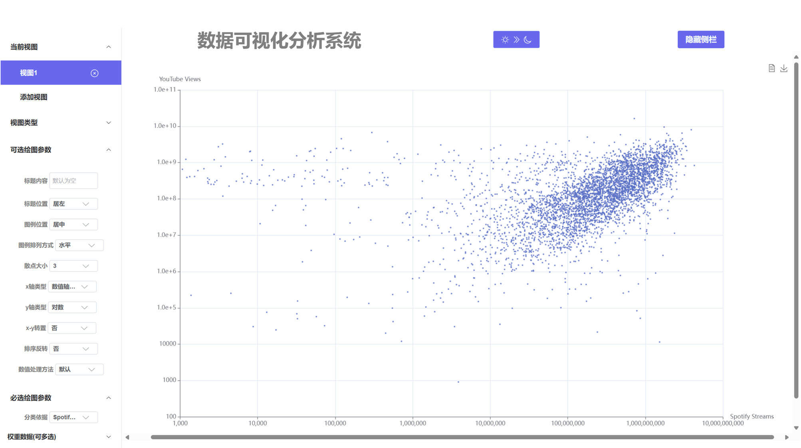
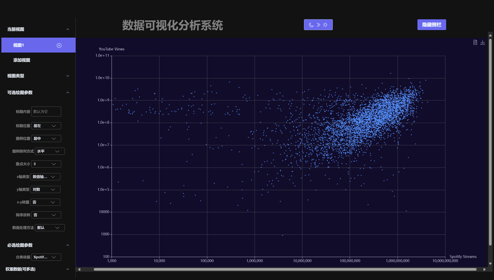
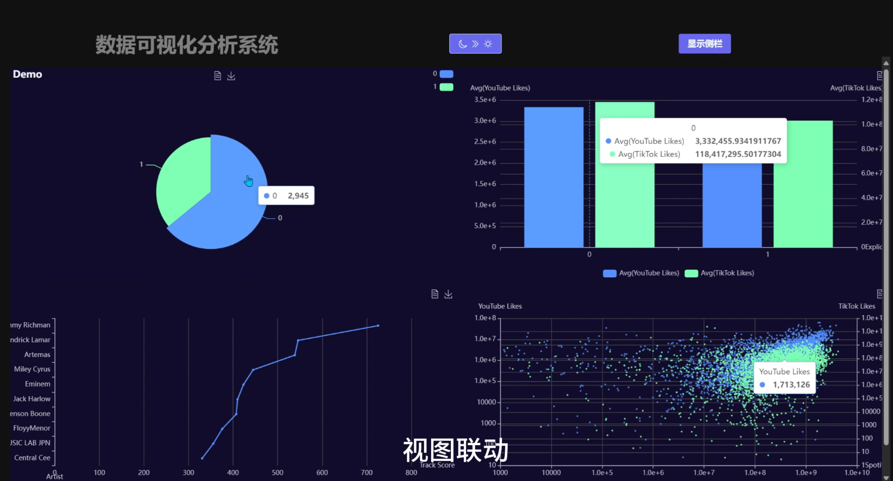

<style>
    pre code { /*实现代码块自动换行*/
        white-space: pre-wrap !important;; /* CSS 3 */
        white-space: -moz-pre-wrap !important; /* Firefox */
        white-space: -pre-wrap !important; /* Opera <7 */
        white-space: -o-pre-wrap !important; /* Opera 7 */
        word-wrap: break-word !important; /* Internet Explorer 5.5+ */
    }
</style>

<div style="height: 100pt;">
</div>

<div style="style=display: block; margin-left: auto; margin-right: auto; width: 60%; height: auto;">
  
  <br>
  <br>
</div>

<div style="height: 40pt;">
</div>

<div style="text-align:center;font-size:20pt;">
    <strong>暑期数据可视化实验报告</strong><br>
    <br>
</div>

<div style="height: 80pt;">
</div>

<div style="display: flex; align-items: center;justify-content: center;font-size:14pt;">
  <div style="display:flex; align-items: center; width: 70pt; background-color: rgba(255, 255, 255, 0);justify-content: center;">
实验名称<span style="margin-right: 7pt">:</span>
</div>
<div style="display:flex; align-items: center; width: 200pt; background-color: rgba(255, 255, 255, 0);justify-content: center;border-bottom: 1pt solid #000;">
数据可视分析系统
</div>
</div>

<div style="height: 7pt;">
</div>

<div style="display: flex; align-items: center;justify-content: center;font-size:14pt;">
  <div style="display:flex; align-items: center; width: 70pt; background-color: rgba(255, 255, 255, 0);justify-content: center;">
小组成员</span><span style="margin-right: 7pt">:</span>
</div>
<div style="display:flex; align-items: center; width: 200pt; background-color: rgba(255, 255, 255, 0);justify-content: center;border-bottom: 1pt solid #000;">
陈锦浩 3230104178
</div>
</div>

<div style="height: 7pt;">
</div>

<div style="display: flex; align-items: center;justify-content: center;font-size:14pt;">
  <div style="display:flex; align-items: center; width: 70pt; background-color: rgba(255, 255, 255, 0);justify-content: center;">
<span style="margin-left: 70pt;"></span>
</div>
<div style="display:flex; align-items: center; width: 200pt; background-color: rgba(255, 255, 255, 0);justify-content: center;border-bottom: 1pt solid #000;">
李浩浩 3220105930
</div>
</div>

<div style="height: 7pt;">
</div>

<div style="display: flex; align-items: center;justify-content: center;font-size:14pt;">
  <div style="display:flex; align-items: center; width: 70pt; background-color: rgba(255, 255, 255, 0);justify-content: center;">
<span style="margin-left: 70pt;"></span>
</div>
<div style="display:flex; align-items: center; width: 200pt; background-color: rgba(255, 255, 255, 0);justify-content: center;border-bottom: 1pt solid #000;">
冯<span style="margin-left: 14pt;"></span>晟 3230104185
</div>
</div>

<div style="height: 7pt;">
</div>


<div style="display: flex; align-items: center;justify-content: center;font-size:14pt;">
  <div style="display:flex; align-items: center; width: 70pt; background-color: rgba(255, 255, 255, 0);justify-content: center;">
课程名称<span style="margin-right: 7pt">:</span>
</div>
<div style="display:flex; align-items: center; width: 200pt; background-color: rgba(255, 255, 255, 0);justify-content: center;border-bottom: 1pt solid #000;">
课程综合实践 I
</div>
</div>

<div style="height: 7pt;">
</div>

<div style="display: flex; align-items: center;justify-content: center;font-size:14pt;">
  <div style="display:flex; align-items: center; width: 70pt; background-color: rgba(255, 255, 255, 0);justify-content: center;">
指导老师<span style="margin-right: 7pt">:</span>
</div>
<div style="display:flex; align-items: center; width: 200pt; background-color: rgba(255, 255, 255, 0);justify-content: center;border-bottom: 1pt solid #000;">
巫英才，陈<span style="margin-left: 14pt;"></span>为
</div>
</div>

<div style="height: 7pt;">
</div>

<div style="display: flex; align-items: center;justify-content: center;font-size:14pt;">
  <div style="display:flex; align-items: center; width: 70pt; background-color: rgba(255, 255, 255, 0);justify-content: center;">
完成时间<span style="margin-right: 7pt">:</span>
</div>
<div style="display:flex; align-items: center; width: 200pt; background-color: rgba(255, 255, 255, 0);justify-content: center;border-bottom: 1pt solid #000;">
2024年7月25日
</div>
</div>

<div style="height: 7pt;">
</div>

<div style="page-break-before: always;"></div>

<div style="height: 14pt;">
</div>

# Part I: 系统设计

## 一、前端设计

### 1. 总体布局(App.vue)

#### 1.1 模板部分

```html
<template>
    <el-container class="layout-container-demo" style="height: 92vh;width: 99vw;">
        <side-bar
            @updateChart="chartUpdated"
            @updateAll="allUpdated"
            :darkMode="darkMode"
            :showSideBar="showSideBar"
            style="width: 15vw;height: 92vh;"
        />
        <head-bar-and-main-contents
            :optionList="optionList"
            :updatesignal="updatesignal"
            :updateallsignal="updateallsignal"
            @themeChanged="handleThemeChange"
            @updateSideBar="sideBarUpdated"
            :selectedChartIndex="selectedChartIndex"
            :groupName="groupName"
            style="width: 84vw;height: 92vh;"
        ></head-bar-and-main-contents>
    </el-container>
</template>
```

可以看到，整个页面由 `el-container` 包裹，其中包含 `side-bar`、`head-bar-and-main-contents` 两个组件。这两个组件分别负责侧边栏和头部导航栏以及主体内容。稍后会详细介绍这两个组件的具体实现。

#### 1.2 脚本部分

```javascript
<script>
import HeadBarAndMainContents from './components/HeadBarAndMainContents.vue'
// 导入头栏
import SideBar from './components/SideBar.vue'
// 导入侧栏

export default {
  name: 'App',
//  自身id
  components: {
    HeadBarAndMainContents,
    SideBar,
    //使用组件
  },
  data() {
    return {
        optionList:[],
        // 存放图表数据的数组，由SideBar传入
        updatesignal:true,
        // 单表更新信号
        updateallsignal:true,
        // 全部更新信号
        darkMode:false,
        selectedChartIndex:-1,
        // 选中的图表序号
        groupName:'',
        showSideBar:true,
    }
  },
  methods: {
    sideBarUpdated(flag){
        this.showSideBar = flag
    },
    chartUpdated(chartOptionList,selectedChartIndex){
        this.optionList[selectedChartIndex]=chartOptionList[selectedChartIndex]
        // 更新选定图表的数据
        this.selectedChartIndex = selectedChartIndex
        // 更新当前选中的图表Index
        this.updatesignal=!this.updatesignal
        // 给HeadBarAndMainContents发送选定图表需要更新的信号
    },
    // 更新一张图表
    allUpdated(chartOptionList,selectedChartIndex){
        this.optionList = chartOptionList
        // 更新全部图表的数据
        //更新删除信息
        this.selectedChartIndex = selectedChartIndex
        // 更新当前选中的图表Index
        this.updateallsignal=!this.updateallsignal
        // 给HeadBarAndMainContents发送所有图表需要更新的信号
    },
    handleThemeChange(theme){
        this.darkMode = theme
        // 接受来自HeadBarAndMainContents的黑夜/白天模式
    },
  },
}
</script>
```

`App.vue` 组件中，定义了 `data` 数据，其中 `optionList` 存放图表数据的数组，`updatesignal` 单表更新信号，`updateallsignal` 全部更新信号，`darkMode` 黑夜/白天模式，`selectedChartIndex` 选中的图表序号，`showSideBar` 侧边栏是否显示，`groupName` 图表分组名称。

`App.vue` 组件中，定义了 `methods` 方法，其中 `sideBarUpdated` 侧边栏更新，`chartUpdated` 单表更新，`allUpdated` 全部更新，`handleThemeChange` 黑夜/白天模式切换。

#### 1.3 样式部分

```css
<style>
    #app {
        font-family: Avenir, Helvetica, Arial, sans-serif;
        -webkit-font-smoothing: antialiased;
        -moz-osx-font-smoothing: grayscale;
        text-align: center;
        color: gray;
        margin-top: 60px;
    }
    @import url("//unpkg.com/element-ui@2.15.6/lib/theme-chalk/index.css");
    /* 引入黑夜模式样式外部声明 */
</style>
```

可以看到，`App.vue` 组件中，定义了 `style` 样式，其中 `@import` 引入了 `element-ui` 组件库的样式。


### 2. 侧边栏(SideBar.vue)

#### 2.1 模板部分

```html
<template>
    <!-- 侧边栏模块，负责实现图类型的选择 -->
    <el-aside width="200px" style="font-weight: bold" v-show="showSideBar">
        <el-scrollbar>
            <el-menu>
                <div index="1">
                    <el-upload
                        v-model:file-list="fileList"
                        :class="upload-demo"
                        action="http://localhost:3000/upload"
                        multiple
                        index="1"
                        :on-preview="handlePreview"
                        :on-remove="handleRemove"
                        :on-success="handleSuccess"
                        :on-error="handleError"

                        :limit="3"
                        :on-exceed="handleExceed"
                        accept=".csv"
                    >
                        <el-button color="#626aef" style="background-color: #626aef;">
                            <!-- 保持颜色 -->
                            <span style="color: aliceblue;">上传文件</span>
                            <el-icon class="el-icon--right" style="color: aliceblue;">
                                <DocumentAdd />
                            </el-icon>
                        </el-button>
                        <template #tip >
                        <div class="el-upload__tip" >
                            仅支持.csv文件
                        </div>
                        </template>
                    </el-upload>
                    <!-- el-upload 是来自Element Plus 的组件，在模块中承担读入文件的任务 -->
                    <br>
                    <div>
                        <span class="inputtext">选中文件 </span>
                        <el-select
                            v-model="selectedFileUid"
                            placeholder='待选择'
                            style="width: 100px;"
                            @change="updateFileDataset"
                        >
                            <el-option
                                v-for="file in fileList"
                                :key="file.uid"
                                :label="file.name"
                                :value="file.uid"
                                :class="{'myoption': darkMode == true}"
                            />
                        </el-select>
                    </div>
                    <br>
                    <!-- 用select表来选择文件，文件选项由v-for给出 -->
                </div>

                <el-sub-menu index="2">
                    <!-- 视图子目录 -->
                    <template #title>
                        当前视图
                    </template>
                    <el-menu-item
                        v-for="chartNum of chartNumList"
                        :key="chartNum.id"
                        @click="changeSelectedChartNum(chartNum)"
                        :class="{'selected':selectedChartNum===chartNum}"
                        >
                        <!-- 列举所有的视图，点击切换选中的视图 -->
                        <span v-if="chartOptionList[chartNum-1].title.text===''">
                            视图{{ chartNum }}
                        </span>
                        <span v-else>
                            {{ chartOptionList[chartNum-1].title.text }}
                        </span>
                        <!-- 依据当前是否有视图进行逻辑判断，防止报错 -->
                         <!-- 这里必须使用v-if，因为v-show不管如何都会执行内部语句，只是不显示，导致逻辑错误 -->
                        <span style="width: 100px;">
                        </span>
                        <span>
                            <el-icon
                            @click="deleteChart(chartNum-1)"
                            class="deleteicon el-icon--right">
                                <circle-close></circle-close>
                            </el-icon>
                        </span>
                        <!-- 提供删除视图选项 -->
                    </el-menu-item>
                    <el-menu-item
                        class="mybutton"
                        @click="addChart"
                    >
                        添加视图
                    </el-menu-item>
                    <!-- 提供添加视图选项 -->
                </el-sub-menu>

                <el-sub-menu index="3" v-if="selectedChartNum>0">
                    <!-- 视图类型子目录 -->
                    <template #title>
                        视图类型
                    </template>
                    <el-menu-item @click="pieChartSelected" :class="{'selected':selectedChartType ==='pie'}" >
                        饼状图
                    </el-menu-item>
                    <el-menu-item @click="barChartSelected" :class="{'selected':selectedChartType==='bar'}" >
                        柱状图
                    </el-menu-item>
                    <el-menu-item @click="lineChartSelected" :class="{'selected':selectedChartType==='line'}" >
                        折线图
                    </el-menu-item>
                    <el-menu-item @click="scatterChartSelected" :class="{'selected':selectedChartType==='scatter'}" >
                        散点图
                    </el-menu-item>
                    <!-- 列举视图类型，允许选择 -->
                    <!-- 当在不同类型的视图间切换时，点击触发的事件将会将当前的option按照视图类型进行对应的初始化 -->
                    <!-- 因此，在使用时，切换视图类型将会丢失原有数据 -->
                </el-sub-menu>

                <el-sub-menu index="4" v-if="selectedChartNum > 0 && selectedChartType !== ''">
                    <!-- 可选绘图参数子目录，只有选择好图表类型后才会显示 -->
                    <template #title>
                        可选绘图参数
                    </template>
                    <!-- 列举一些共用的且可选可不选的绘图参数，参数默认值在组件内给出 -->
                    <br>
                    <div >
                        <span class="inputtext">标题内容 </span>
                        <el-input
                            v-model="selectedChartOption.title.text"
                            style="width: 100px"
                            placeholder="默认为空"
                            clearable
                            @change="updateChartData"
                        />
                        <!-- 每当参数被改变时，更新当前选中的图表数据，从而触发图表更新 -->
                    </div>
                    <br>
                    <div >
                        <span class="inputtext">标题位置 </span>
                        <el-select
                            v-model="selectedChartOption.title.left"
                            placeholder='居左'
                            style="width: 100px;"
                            @change="updateChartData"
                        >
                            <el-option
                                v-for="leftOption in leftOptions"
                                :key="leftOption.value"
                                :label="leftOption.label"
                                :value="leftOption.value"
                                :class="{'myoption': darkMode == true}"
                            />
                            <!-- class根据黑夜模式与否修改option单选框的样式，防止对比度过低 -->
                        </el-select>
                    </div>
                    <br>
                    <div >
                        <span class="inputtext">图例位置 </span>
                        <el-select
                            v-model="selectedChartOption.legend.left"
                            placeholder='居中'
                            style="width: 100px;"
                            @change="updateChartData"
                        >
                            <el-option
                                v-for="leftOption in leftOptions"
                                :key="leftOption.value"
                                :label="leftOption.label"
                                :value="leftOption.value"
                                :class="{'myoption': darkMode == true}"
                            />
                        </el-select>
                    </div>
                    <br>
                    <div >
                        <span class="inputtext">图例排列方式 </span>
                        <el-select
                            v-model="selectedChartOption.legend.orient"
                            placeholder='垂直'
                            style="width: 100px;"
                            @change="updateChartData"
                        >
                            <el-option
                                v-for="listOption in listOptions"
                                :key="listOption.value"
                                :label="listOption.label"
                                :value="listOption.value"
                                :class="{'myoption': darkMode == true}"
                            />
                        </el-select>
                    </div>
                    <div v-if="selectedChartType === 'scatter'">
                        <br>
                        <!-- 当所选图表类型为散点图时显示 -->
                        <span class="inputtext" >散点大小 </span>
                        <el-select
                            v-model="selectedChartOption.symbolSize"
                            placeholder='15'
                            style="width: 100px;"
                            @change="updateChartData"
                        >
                            <el-option
                                v-for="symbolSizeOption in symbolSizeOptionList"
                                :key="symbolSizeOption.label"
                                :label="symbolSizeOption.label"
                                :value="symbolSizeOption.value"
                                :class="{'myoption': darkMode == true}"
                            />
                        </el-select>
                    </div>
                    <div v-if="selectedChartOption.xAxis">
                        <br>
                        <!-- 当所选图表类型拥有x轴时显示 -->
                        <span class="inputtext" >x轴类型 </span>
                        <el-select
                            v-model="selectedChartOption.xAxis.type"
                            placeholder='类别轴'
                            style="width: 100px;"
                            @change="updateChartData"
                        >
                            <el-option
                                v-for="axisTypeOption in axisTypeOptionList"
                                :key="axisTypeOption.label"
                                :label="axisTypeOption.label"
                                :value="axisTypeOption.value"
                                :class="{'myoption': darkMode == true}"
                            />
                        </el-select>
                    </div>
                    <div v-if="selectedChartOption.yAxis">
                        <br>
                        <!-- 当所选图表类型拥有x轴时显示 -->
                        <span class="inputtext" >y轴类型 </span>
                        <el-select
                            v-model="selectedChartOption.ytype"
                            placeholder='默认'
                            style="width: 100px;"
                            @change="updateChartData"
                        >
                            <el-option
                                v-for="yType in yTypeList"
                                :key="yType.label"
                                :label="yType.label"
                                :value="yType.value"
                                :class="{'myoption': darkMode == true}"
                            />
                        </el-select>
                    </div>
                    <div v-if="selectedChartType !== 'pie'">
                        <br>
                        <!-- 当所选图表类型非饼图时显示 -->
                        <span class="inputtext" >x-y转置 </span>
                        <el-select
                            v-model="selectedChartOption.invert"
                            placeholder='否'
                            style="width: 100px;"
                            @change="updateChartData"
                        >
                            <el-option
                                v-for="invertOption in invertOptionList"
                                :key="invertOption.label"
                                :label="invertOption.label"
                                :value="invertOption.value"
                                :class="{'myoption': darkMode == true}"
                            />
                        </el-select>
                    </div>
                    <div v-if="selectedChartType !== 'pie'">
                        <br>
                        <!-- 当所选图表类型非饼图时显示 -->
                        <span class="inputtext" >排序反转 </span>
                        <el-select
                            v-model="selectedChartOption.xAxis.inverse"
                            placeholder='否'
                            style="width: 100px;"
                            @change="updateChartData"
                        >
                            <el-option
                                v-for="inverseOption in inverseOptionList"
                                :key="inverseOption.label"
                                :label="inverseOption.label"
                                :value="inverseOption.value"
                                :class="{'myoption': darkMode == true}"
                            />
                        </el-select>
                    </div>
                    <br>
                    <div >
                        <span class="inputtext">数值处理方法 </span>
                        <el-select
                            v-model="selectedChartOption.dataMethod"
                            placeholder='默认'
                            style="width: 100px;"
                            @change="updateChartData"
                            @click="tips"
                        >
                            <el-option
                                v-for="datamethod in dataMethodList"
                                :key="datamethod"
                                :label="datamethod.label"
                                :value="datamethod.value"
                                :class="{'myoption': darkMode == true}"
                            />
                        </el-select>
                        <!-- 提供基本的数据处理功能 -->
                    </div>
                    <br>
                </el-sub-menu>
                <el-sub-menu index="5" v-if="selectedChartNum > 0 && selectedChartType !==''">
                    <template #title>
                        必选绘图参数
                    </template>

                    <!-- 依据绘图种类不同，提供不同的必选绘图参数 -->
                    <div v-if="selectedChartType ==='pie'" >
                        <br>
                        <div >
                            <span class="inputtext">分类依据 </span>
                            <el-select
                                v-model="selectedChartOption.series[0].encode.itemName"
                                placeholder='待选择'
                                style="width: 100px;"
                                @change="updateChartData"
                            >
                                <el-option
                                    v-for="keyword in selectedChartOption.dataset.source[0]"
                                    :key="keyword"
                                    :label="keyword"
                                    :value="keyword"
                                    :class="{'myoption': darkMode == true}"
                                />
                            </el-select>
                            <!-- 选择用于分类的数据维度 -->
                        </div>
                        <br>
                        <div >
                            <span class="inputtext">权重数据 </span>
                            <el-select
                                v-model="selectedChartOption.series[0].encode.value"
                                placeholder='待选择'
                                style="width: 100px;"
                                @change="updateChartData"
                            >
                                <el-option
                                    v-for="keyword in selectedChartOption.dataset.source[0]"
                                    :key="keyword"
                                    :label="keyword"
                                    :value="keyword"
                                    :class="{'myoption':darkMode == true}"
                                />
                            </el-select>
                            <!-- 也就是被比较的数值 -->
                        </div>
                        <br>
                    </div>

                    <div v-else>
                        <!-- 柱形图，折线图和散点图的参数较为类似，所以一起处理 -->
                        <div>
                            <span class="inputtext">x轴数据 </span>
                            <el-select
                                v-model="selectedCategories[selectedChartIndex]"
                                placeholder='待选择'
                                style="width: 100px;"
                                @change="updateCategory(selectedCategories[selectedChartIndex])"
                            >
                                <el-option
                                    v-for="keyword in chartOptionList[selectedChartIndex].dataset.source[0]"
                                    :key="keyword"
                                    :label="keyword"
                                    :value="keyword"
                                    :class="{'myoption': darkMode == true}"
                                />
                            </el-select>
                            <!-- 选择用于分类的数据维度 -->
                            <el-sub-menu >
                                <template #title>
                                    <span style="margin-left: -2em; font-size: small;">y轴数据(可多选)</span>
                                </template>
                                <!-- 这里提供可多选的y轴数据 -->
                                <el-menu-item
                                    v-for="y in barLikeSeriesChosen[selectedChartIndex]"
                                    :key="y.name"
                                    @click="nameSelected(selectedCategories[selectedChartIndex],y.name)"
                                    :class="{'selected':y.state}"
                                    style="font-size: small;
                                    height: 2em;
                                    margin-left: -4em;">
                                    {{ y.name }}
                                </el-menu-item>
                                <!-- barLikeSeriesChosen是一个数组，其元素可以看作当前图表的source中的数据类型配上指示数据类型是否被选中的布尔state，用于配合这里的按钮实现多选功能 -->
                                 <!-- 至于selectedCategories则是另一个存储当前x轴数据种类选择情况的数组 -->
                            </el-sub-menu>
                        </div>
                    </div>
                </el-sub-menu>
            </el-menu>
        </el-scrollbar>
    </el-aside>
</template>
```
可以看到，侧边栏的结构是由el-menu和el-submenu构成的，其中el-menu是整个侧边栏的主目录，el-submenu是其子目录，每个el-submenu都有自己的标题和内容。

侧边栏的主要功能是：

1. 显示当前已选中的文件
2. 显示当前已选中的图表
3. 显示当前已选中的图表类型
4. 显示当前可选的绘图参数
5. 显示当前必选的绘图参数


#### 2.2 脚本部分

```javascript
<script>
    import { DocumentAdd, CircleClose } from '@element-plus/icons-vue';
    // 导入所需图标
    const dataProcessMethod = require('./dataProcessMethod.js')
    // 导入数据处理函数
    export default{
        components:{
            DocumentAdd,
            CircleClose
        },
        data() {
            return {
                selectedChartNum:0,
                // 反映当前已选中的图表是第几个，值为index+1
                chartNumList:[],
                //chartNumList内的元素从1开始
                fileList: [],
                fileDataMap: [],
                // 存储文件和对应数据的数组，里面每个元素有两个子元素，uid和data，分别表示文件id和文件对应的数据
                selectedFileUid:0,
                //当前选中的文件的uid
                selectedChartTypeList:[],
                // 存储各个视图的种类
                selectedCategories:[],
                //非饼图选择x轴数据类型的辅助数组
                fileDataset:{
                    source:[
                        [],
                    ]
                    // 存放选中文件的数据，在addChart时被调用
                },
                barLikeSeriesChosen:[],
                // 一个数组，其元素可以看作当前图表的source中的数据类型配上指示数据类型是否被选中的布尔state，用于配合按钮实现y轴数据多选功能
                chartOptionList:[],
                // 绘图option的列表
                leftOptions:[
                    {
                        value:'center',
                        label:'居中'
                    },
                    {
                        value:'left',
                        label:'居左'
                    },
                    {
                        value:'right',
                        label:'居右'
                    }
                ],
                listOptions:[
                    {
                        value:'horizontal',
                        label:'水平'
                    },
                    {
                        value:'vertical',
                        label:'垂直'
                    }
                ],
                axisTypeOptionList:[
                    {
                        label:'类别轴',
                        value:'category'
                    },
                    {
                        label:'数值轴(默认)',
                        value:'value'
                    },
                    {
                        label:'数值轴(对数)',
                        value:'log'
                    },
                    {
                        label:'时间轴',
                        value:'time'
                    }
                ],
                dataMethodList:[
                    {
                        label:'默认',
                        value:'Default'
                    },
                    {
                        label:'取平均',
                        value:'Avg'
                    },
                    {
                        label:'求和',
                        value:'Sum'
                    },
                    {
                        label:'计数',
                        value:'Count'
                    },
                    {
                        label:'取方差',
                        value:'Var'
                    },
                    {
                        label:'取标准差',
                        value:'Std'
                    }
                ],
                invertOptionList:[
                    {
                        label:'否',
                        value:false
                    },
                    {
                        label:'是',
                        value:true
                    }
                ],
                inverseOptionList:[
                    {
                        label:'否',
                        value:false
                    },
                    {
                        label:'是',
                        value:'true'
                    }
                ],
                symbolSizeOptionList:[
                    {
                        label:'3',
                        value: 3
                    },
                    {
                        label:'5',
                        value:5
                    },
                    {
                        label:'10',
                        value:10
                    },
                    {
                        label:'15',
                        value:15
                    },
                    {
                        label:'20',
                        value:20
                    }
                ],
                yTypeList:[
                    {
                        label:'默认',
                        value:'default'
                    },
                    {
                        label:'对数',
                        value:'log'
                    }
                ]
                // 用于列举可选参数的静态列表
            }
        },
        methods: {
            tips(){
                if(this.selectedChartType!=='pie'){
                    this.$message.warning(`如果y轴绑定多组数据，建议最后选择数据处理方式哦~`);
                }
                // 关于数值处理方法的小提示
            },
            changeSelectedChartNum(num){
                this.selectedChartNum = num
            },
            // 更新当前选中的图表序号
            updateFileDataset() {
                let retryCount = 0;
                const maxRetries = 5;
                const retryInterval = 1000;
                const findFile = () => {
                    const index = this.fileDataMap.findIndex(item => item.uid === this.selectedFileUid);
                    if (index !== -1) {
                        this.fileDataset = this.fileDataMap[index].dataset;
                        this.$message.success('文件已选中 :)')
                        // 更新文件uid，用于多图联动时的连接
                    } else if (retryCount < maxRetries) {
                        this.$message.warning(`文件还没加载好，一秒后为您重试！`);
                        retryCount++;
                        setTimeout(findFile, retryInterval);
                    } else {
                        this.$message.warning('啊吧啊吧……文件加载失败了 :( 请重启浏览器 QAQ');
                    }
                };
                findFile();
            },
            addPieSerie(option){
                let newPieSerie = {
                    type:'pie',
                    encode:{
                        itemName:'',
                        value:'',
                        x:'',
                        y:'',
                    },
                    name:'',
                    radius:'50%',
                    center:['45%','57%']
                }
                option.series.push(newPieSerie)
                // 用于添加一个空白的饼图serie，在饼图option初始化中使用
            },
            addBarLikeSerie(option,charttype,xvalue,yvalue){
                // 用于添加一个有值的非pie类图的serie
                let newBarLikeSerie = {
                    type: charttype,
                    encode:{
                        itemName:'',
                        value:'',
                        x:xvalue,
                        y:yvalue,
                    },
                    name:yvalue
                }
                option.series.push(newBarLikeSerie)
                // 添加serie
                if(option.series.length === 1){
                    let newY = {
                        name:yvalue,
                        type: 'value',
                        axisLabel: {
                            formatter: function (value) {
                                return value >= 100000 ? value.toExponential(1) : value;
                                // 条件选择科学计数法
                            }
                        }
                    }
                    option.yAxis[0]=newY
                }
                else if(option.series.length === 2){
                    let newY1 = {
                        name:yvalue,
                        position:'right',
                        type: 'value',
                        axisLabel: {
                            formatter: function (value) {
                                return value >= 100000 ? value.toExponential(1) : value;
                            }
                        }
                    }
                    option.yAxis[1]=newY1
                    let newY0 = {
                        name:option.series[0].encode.y,
                        type: 'value',
                        axisLabel: {
                            formatter: function (value) {
                                return value >= 100000 ? value.toExponential(1) : value;
                            }
                        }
                    }
                    option.yAxis[0]=newY0
                }
                else {
                    option.yAxis = [{
                        type:'value',
                        axisLabel: {
                            formatter: function (value) {
                                return value >= 100000 ? value.toExponential(1) : value;
                            }
                        }
                    }]
                }
                // 为双轴柱形图自动设置双轴样式
                // 为过大的轴标度提供科学计数法的显示方法
            },
            deleteBarLikeSerie(option,xvalue,yvalue){
                // 删除非pie类的特定serie
                if(option.series){
                    option.series = option.series.filter(function(item){
                        return !(item.encode.x === xvalue && item.encode.y === yvalue)
                    })
                    // 筛去 encode数据对应的serie
                    // 删除时也需要注意双轴情况的处理
                    if(option.series.length === 2){
                        let newY0 = {
                            name: option.series[0].encode.y,
                            type: 'value',
                            axisLabel: {
                                formatter: function (value) {
                                    return value >= 100000 ? value.toExponential(1) : value;
                                }
                            }
                        }
                        option.yAxis[0]=newY0
                        let newY1 = {
                            name: option.series[1].encode.y,
                            position:'right',
                            type: 'value',
                            axisLabel: {
                                formatter: function (value) {
                                    return value >= 100000 ? value.toExponential(1) : value;
                                }
                            }
                        }
                        option.yAxis[1]=newY1
                    }
                    else if(option.series.length === 1){
                        let newY0 = {
                            name: option.series[0].encode.y,
                            type: 'value',
                            axisLabel: {
                                formatter: function (value) {
                                    return value >= 100000 ? value.toExponential(1) : value;
                                }
                            }
                        }
                        option.yAxis[0]=newY0
                    }
                    else{
                        option.yAxis = [{
                            type:'value',
                            axisLabel: {
                                formatter: function (value) {
                                    return value >= 100000 ? value.toExponential(1) : value;
                                }
                            }
                        }]
                    }
                }
            },
            destroySeries(option){
                option.series=[]
            },
            // 销毁所有的series，初始化时用于清除数据
            deleteChart(index){
            // 删除指定index的图表
                this.selectedChartNum--
                // 如果删除的表在已选中的表前面，应当改选前面一张表，这个操作要放在最前面，防止未定义情况的发生
                this.chartNumList.splice(index,1)
                // 在chartNumList中删除图表
                for(let i = index ; i< this.chartNumList.length;i++){
                    this.chartNumList[i]--
                }
                // 修改chartNumList的值保持正常
                this.chartOptionList.splice(index,1)
                // 在chartOptionList中删除图表
                this.barLikeSeriesChosen.splice(index,1)
                this.selectedCategories.splice(index,1)
                this.selectedChartTypeList.splice(index,1)
                // 在各种辅助数组里删除图表信息
                this.updateAll()
                // 删除某张图表改变图表顺序与布局，因此更新所有图表
            },
            barLikeSeriesTurnFalse(index){
                for(let i = 0; i < this.barLikeSeriesChosen[index].length; i++){
                    this.barLikeSeriesChosen[index][i].state = false
                }
            },
            // 把barLikeSeries中所有的state变成false，模拟任何y轴数据都未选中
            updateCategory(xname){
                if(this.selectedChartOption.series){
                    for(let i = 0; i< this.selectedChartOption.series.length;i++){
                        this.selectedChartOption.series[i].encode.x = xname
                    }
                    this.selectedChartOption.xAxis.name = xname
                }
                this.updateChartData()
            },
            // 更新非pie图选中的x轴数据
            nameSelected(xname,yname){
            // 配合多选按钮实现某种serie的增添与删除
                const state=this.barLikeSeriesChosen[this.selectedChartIndex].find(item => item.name === yname).state
                // 找到指定y轴数据对应的状态
                if(state){
                    this.deleteBarLikeSerie(this.selectedChartOption,xname,yname)
                    this.barLikeSeriesChosen[this.selectedChartIndex].find(item => item.name === yname).state = false
                    // 已选中，则删除
                }
                else{
                    this.addBarLikeSerie(this.selectedChartOption,this.selectedChartType,xname,yname)
                    this.barLikeSeriesChosen[this.selectedChartIndex].find(item => item.name === yname).state = true
                    // 未删除，则选中
                }
                this.updateChartData()
            },
            pieChartSelected(){
            // 饼图初始化
                if(this.selectedChartNum>0){
                    if(this.selectedChartType !== 'pie'){
                    // 只有之前非饼图时触发初始化与更新
                        this.destroySeries(this.selectedChartOption)
                        // 清空series
                        this.addPieSerie(this.selectedChartOption)
                        // 添加空serie
                        delete this.selectedChartOption.symbolSize
                        this.selectedChartOption.tooltip.trigger='item'
                        this.selectedChartOption.legend.left='right'
                        delete this.selectedChartOption.legend.bottom
                        this.selectedChartOption.legend.orient='vertical'
                        delete this.selectedChartOption.xAxis
                        delete this.selectedChartOption.yAxis
                        delete this.selectedChartOption.ytype
                        this.selectedChartOption.dataMethod = 'Default'
                        // 添加独有参数，删去不必要参数
                        this.selectedChartTypeList[this.selectedChartIndex] = 'pie'
                        this.barLikeSeriesTurnFalse(this.selectedChartIndex)
                        // 取消非pie图已选中的y轴数据
                        this.selectedCategories[this.selectedChartIndex]=''
                        // 饼图没有x轴
                        this.selectedChartOption.toolbox = {
                            show: true,
                            feature: {
                                dataView: { show: true, readOnly: false },
                                magicType: { show: false},
                                restore: { show: false },
                                saveAsImage: { show: true }
                            },
                            left:'45%'
                        }
                        this.selectedChartOption.invert = false
                        this.updateChartData()
                    }
                }

            },
            barChartSelected(){
            // 柱形图初始化
                if(this.selectedChartNum>0){
                    if(this.selectedChartType !== 'bar'){
                        this.destroySeries(this.selectedChartOption)
                        this.selectedChartOption.tooltip.trigger='axis'
                        this.selectedChartOption.xAxis={
                            type:'category',
                            inverse:false,
                            axisLabel:{
                                formatter: function (value) {
                                    if (typeof value === 'string') {
                                        // 如果值是字符串且能转换为日期，则尝试将值解释为日期
                                        const date = new Date(value);
                                        if (!isNaN(date.getTime())) {
                                            // 确保这是一个有效的日期
                                            return `${date.getFullYear()}-${String(date.getMonth() + 1).padStart(2, '0')}-${String(date.getDate()).padStart(2, '0')}`;
                                        }
                                    }
                                    // 对于数字，执行数值格式化
                                    else if (typeof value === 'number') {
                                        return value >= 100000 ? value.toExponential(1) : value;
                                    }
                                    // 兜底返回原始值
                                    return value;
                                }
                            }
                        }
                        delete this.selectedChartOption.symbolSize
                        this.selectedChartOption.ytype = 'default'
                        this.selectedChartOption.yAxis=[{}]
                        this.selectedChartOption.legend.left='center'
                        this.selectedChartOption.legend.orient = 'horizontal'
                        this.selectedChartOption.legend.bottom = 10
                        this.selectedChartOption.dataMethod = 'Default'
                        this.selectedChartTypeList[this.selectedChartIndex]='bar'
                        this.barLikeSeriesTurnFalse(this.selectedChartIndex)
                        this.selectedCategories[this.selectedChartIndex]=''
                        this.selectedChartOption.toolbox = {
                            show: true,
                            feature: {
                                dataView: { show: true, readOnly: false },
                                magicType: { show: false},
                                restore: { show: false },
                                saveAsImage: { show: true }
                            }
                        }
                        this.selectedChartOption.invert = false
                        this.updateChartData()
                    }
                }
            },
            lineChartSelected(){
            // 折线图初始化
                if(this.selectedChartNum>0){
                    if(this.selectedChartType !== 'line'){
                        this.destroySeries(this.selectedChartOption)
                        this.selectedChartOption.tooltip.trigger='axis'
                        this.selectedChartOption.xAxis={
                            type:'category',
                            inverse:false,
                            axisLabel:{
                                formatter: function (value) {
                                    if (typeof value === 'string') {
                                        // 如果值是字符串且能转换为日期，则尝试将值解释为日期
                                        const date = new Date(value);
                                        if (!isNaN(date.getTime())) {
                                            // 确保这是一个有效的日期
                                            return `${date.getFullYear()}-${String(date.getMonth() + 1).padStart(2, '0')}-${String(date.getDate()).padStart(2, '0')}`;
                                        }
                                    }
                                    // 对于数字，执行数值格式化
                                    else if (typeof value === 'number') {
                                        return value >= 100000 ? value.toExponential(1) : value;
                                    }
                                    // 兜底返回原始值
                                    return value;
                                }
                            }
                        }
                        delete this.selectedChartOption.symbolSize
                        this.selectedChartOption.yAxis=[{}]
                        this.selectedChartOption.ytype = 'default'
                        this.selectedChartOption.legend.left='center'
                        this.selectedChartOption.legend.bottom = 10
                        this.selectedChartOption.legend.orient = 'horizontal'
                        this.selectedChartOption.dataMethod = 'Default'
                        this.selectedChartTypeList[this.selectedChartIndex]='line'
                        this.barLikeSeriesTurnFalse(this.selectedChartIndex)
                        this.selectedCategories[this.selectedChartIndex]=''
                        this.selectedChartOption.toolbox = {
                            show: true,
                            feature: {
                                dataView: { show: true, readOnly: false },
                                magicType: { show: false},
                                restore: { show: false },
                                saveAsImage: { show: true }
                            }
                        }
                        this.selectedChartOption.invert = false
                        this.updateChartData()
                    }
                }

            },
            scatterChartSelected(){
            // 散点图初始化
                if(this.selectedChartNum>0){
                    if(this.selectedChartType !== 'scatter'){
                        this.destroySeries(this.selectedChartOption)
                        this.selectedChartOption.tooltip.trigger='item'
                        this.selectedChartOption.symbolSize = 10
                        this.selectedChartOption.xAxis={
                            type:'category',
                            inverse:false,
                            axisLabel:{
                                formatter: function (value) {
                                    if (typeof value === 'string') {
                                        // 如果值是字符串且能转换为日期，则尝试将值解释为日期
                                        const date = new Date(value);
                                        if (!isNaN(date.getTime())) {
                                            // 确保这是一个有效的日期
                                            return `${date.getFullYear()}-${String(date.getMonth() + 1).padStart(2, '0')}-${String(date.getDate()).padStart(2, '0')}`;
                                        }
                                    }
                                    // 对于数字，执行数值格式化
                                    else if (typeof value === 'number') {
                                        return value >= 100000 ? value.toExponential(1) : value;
                                    }
                                    // 兜底返回原始值
                                    return value;
                                }
                            }
                        }
                        this.selectedChartOption.yAxis=[{}]
                        this.selectedChartOption.ytype = 'default'
                        this.selectedChartOption.legend.left='center'
                        this.selectedChartOption.legend.bottom = 10
                        this.selectedChartOption.legend.orient = 'horizontal'
                        this.selectedChartOption.dataMethod = 'Default'
                        this.selectedChartTypeList[this.selectedChartIndex]='scatter'
                        this.barLikeSeriesTurnFalse(this.selectedChartIndex)
                        this.selectedCategories[this.selectedChartIndex]=''
                        this.selectedChartOption.toolbox = {
                            show: true,
                            feature: {
                                dataView: { show: true, readOnly: false },
                                magicType: { show: false},
                                restore: { show: false },
                                saveAsImage: { show: true }
                            }
                        }
                        this.selectedChartOption.invert = false
                        this.updateChartData()
                    }
                }
            },
            // 改变当前选中的图表的种类
            addChart(){
            //添加一个图表，添加一些公用的基本参数
                if(this.selectedFileUid==0){
                    this.$message.warning(`请先选中文件！`);
                }
                else{
                    if(this.chartNumList.length === 6){
                        this.$message.warning(`页面被塞满啦，删除一些图表吧~`);
                        return
                    }
                    this.chartNumList.push(this.chartNumList.length+1)
                    // 在chartNumList中添加
                    let newChartOption=
                    {
                        invert:false,
                        group:this.selectedFileUid.toString(),
                        dataMethod:'Default',
                        title: {
                            text: '',
                            left: 'left',
                        },
                        tooltip: {
                            trigger:''
                        },
                        legend: {
                            left: 'center',
                            orient: 'vertical',
                        },
                        dataset:{
                            source:[
                                []
                            ]
                        },
                        series: [
                            {
                                type:'',
                                encode: {
                                    itemName: '',
                                    value: '',
                                    x: '',
                                    y: ''
                                },
                                name:''
                            }
                        ],
                    }
                    this.selectedChartNum = this.chartNumList.length
                    // 必须先改变selectedChartNum再改变selectedChartTypeList
                    // 这里设置添加后即选中这张图表
                    this.selectedChartTypeList[this.selectedChartIndex]=''
                    // 设置其种类未知
                    newChartOption.dataset=this.fileDataset
                    // 传入当前文件数据
                    this.chartOptionList.push(newChartOption)
                    //在chartOptionList中添加
                    let newBarLikeSerie = [];
                    for (let i = 0; i < this.fileDataset.source[0].length; i++) {
                        newBarLikeSerie[i] = {
                            name:  this.fileDataset.source[0][i],
                            state: false
                        };
                    }
                    this.barLikeSeriesChosen.push(newBarLikeSerie)
                    // 添加预备的辅助数组
                    this.selectedCategories.push('')
                    // x轴未选中，置空
                    this.updateAll()
                    this.$message.success('根据文件 '+this.fileList.find(item=>item.uid===this.selectedFileUid).name+' 生成视图 :)')
                }
            },
            updateAll(){
                this.$emit('updateAll',this.chartOptionList, this.selectedChartIndex)
            },
            // 发送事件更新所有图表
            updateChartData(){
                if(!this.selectedChartOption.series[0] || (this.selectedChartOption.series[0].encode.y === '' && this.selectedChartOption.series[0].encode.value === '') ){
                    this.selectedChartOption.dataset = this.fileDataset
                    // 不符合数据处理要求，数据取当前文件数据
                }
                else{
                    this.selectedChartOption.dataset=dataProcessMethod.dataProcess(this.selectedChartOption.series, this.fileDataset, this.selectedChartOption.dataMethod)
                    // 进行数据处理
                }
                if(this.selectedChartTypeList[this.selectedChartIndex] !== 'pie'){
                    // 对于非饼图，要依据得到更新的dataset更新它们的辅助数组
                    this.barLikeSeriesChosen[this.selectedChartIndex]=[]
                    for(let i = 0; i < this.selectedChartOption.dataset.source[0].length ; i++){
                        this.barLikeSeriesChosen[this.selectedChartIndex].push({
                            name: this.selectedChartOption.dataset.source[0][i],
                            state: false
                        })
                    }
                    for(let i = 0; i < this.selectedChartOption.series.length ; i++){
                        this.barLikeSeriesChosen[this.selectedChartIndex].find(item => item.name === this.selectedChartOption.series[i].encode.y).state = true
                    }
                    if(this.selectedChartOption.yAxis){
                        if(this.selectedChartOption.series.length == 2){
                            this.selectedChartOption.yAxis[0].name = this.selectedChartOption.series[0].encode.y
                            this.selectedChartOption.yAxis[1].name = this.selectedChartOption.series[1].encode.y
                        }
                        else if(this.selectedChartOption.series.length == 1){
                            this.selectedChartOption.yAxis[0].name = this.selectedChartOption.series[0].encode.y
                        }
                    }
                }
                this.$emit('updateChart', this.chartOptionList, this.selectedChartIndex)
            },
            // 发送事件更新单张图表
            handlePreview(file) {
                console.log('preview', file);
            },
            handleRemove(file, fileList) { // 在删除文件的同时，将组件内的数据也删除
                console.log('remove', file, fileList);
                const index = this.fileDataMap.findIndex(item => item.uid === file.uid)
                if(index !== -1){
                    this.fileDataMap.splice(index, 1)
                }
            },
            beforeRemove(file) {
                return this.$confirm(`确定移除 ${file.name}?`);
            },
            handleSuccess(response, file, fileList) { // 上传成功后，将文件和对应数据存储到组件内的数组中
                console.log('success', response, file, fileList);
                this.$message.success(`${file.name} 上传成功`);
                this.fileDataMap.push({
                    uid: file.uid,
                    dataset: {source: response.data},
                });
                console.log('存储的数据:', this.fileDataMap);
            },
            handleError(err, file, fileList) {
                console.log('error', err, file, fileList);
                this.$message.error(`${file.name} 上传失败`);
            },
            submitUpload() {
                this.$refs.upload.submit();
            },
            handleExceed() {
                this.$message.warning(`最多只能上传 3 个文件.`);
            },
        },
        props:{
            darkMode:Boolean,
            showSideBar:Boolean
            // 接受当前的页面风格是黑夜还是白天，false为白天
        },
        computed:{
            selectedChartIndex(){
                return this.selectedChartNum-1
            },
            // 选中图表的index
            selectedChartType(){
                return this.selectedChartNum > 0 ? this.selectedChartTypeList[this.selectedChartIndex] : ''
            },
            // 选中图表的类型
            selectedChartOption(){
                return this.selectedChartNum > 0 ? this.chartOptionList[this.selectedChartIndex] : {}
            }
            // 选中图表的option
        },
        watch:{
            showSideBar:function(){
                this.updateAll()
            }
        }
    }
</script>
```

##### 2.2.1 导入和组件注册
```javascript
import { DocumentAdd, CircleClose } from '@element-plus/icons-vue';
const dataProcessMethod = require('./dataProcessMethod.js')
```
- **图标导入**：从 `@element-plus/icons-vue` 导入了 `DocumentAdd` 和 `CircleClose` 图标，这些用于显示添加文档和关闭操作的按钮。
- **数据处理方法导入**：从本地文件 `dataProcessMethod.js` 导入数据处理函数，该函数用于处理图表数据。

##### 2.2.2 数据属性（data）
组件的 `data` 方法返回一个对象，该对象包含组件的状态和配置信息：
- **图表和文件相关**：如 `selectedChartNum`（当前选中的图表编号）、`chartNumList`（图表编号列表）、`fileList`（文件列表）、`fileDataMap`（文件与数据的映射）等。
- **图表配置**：如 `chartOptionList`（图表配置列表）、`selectedCategories`（选中的类别）、`selectedChartTypeList`（图表类型列表）等。
- **选项配置**：提供了一系列静态列表（如 `leftOptions`, `listOptions`, `axisTypeOptionList` 等），用于配置图表的不同选项。

##### 2.2.3 方法（methods）
组件定义了多个方法，用于执行各种操作：
- **图表操作**：如 `addChart`（添加图表）、`deleteChart`（删除图表）、`updateChartData`（更新图表数据）等。
- **文件处理**：如 `handlePreview`、`handleRemove`、`handleSuccess`（处理文件预览、移除和上传成功的操作）。
- **图表系列操作**：如 `pieChartSelected`、`barChartSelected`、`lineChartSelected`、`scatterChartSelected`，用于在选择图表类型时完成对应的初始化。
- **交互提示**：如 `tips`，提供操作前的用户提示。

##### 2.2.4 计算属性（computed）
- **`selectedChartIndex`**：根据当前选中的图表编号计算出的索引。
- **`selectedChartType`**：返回当前选中的图表类型。
- **`selectedChartOption`**：返回当前选中图表的配置选项。

##### 2.2.5 监听器（watch）
- **`showSideBar`**：监听侧边栏的显示状态，当侧边栏显示状态改变时更新所有图表。

##### 2.2.6 组件和道具（components & props）
- **组件**：注册了 `DocumentAdd` 和 `CircleClose` 为子组件。
- **道具**：接收 `darkMode` 和 `showSideBar` 两个布尔类型的属性，这些属性用于控制主题模式和侧边栏的显示。


#### 2.3 样式部分

```css
<style scoped>
    .selected{
        background-color: #626aef!important;
        color: aliceblue;
    }
    .inputtext{
        font-size: 0.5em
    }
    .mybutton:focus{
        background-color: rgba(0, 0,0, 0)
    }
    .mybutton:active{
        background-color: gray;
    }
    .deleteicon:hover{
        color: red;
    }
    .myoption{
        background-color: gray;
        color: white;
        font-weight: bold;
    }
</style>
```

可以看到，侧边栏的样式部分主要负责侧边栏的整体样式，包括选中状态、按钮样式、输入框样式、图例样式等。

### 3. 头部导航栏及主体部分(HeadBarAndMainContents.vue)

#### 3.1 模板部分

```html
<template>
    <el-container :class="showSideBar == true ? 'with-side-bar-whole' : 'without-side-bar-whole'" >
        <el-header style=" font-size: 2em ;display :flex ;justify-content: space-around; align-items:center; " :class="showSideBar == true ? 'with-side-bar-header' : 'without-side-bar-header'">
            <!-- 设置头栏字号，排列与对齐样式等 -->
            <h1>数据可视化分析系统</h1>

            <el-button color="#626aef" @click="changeTheme" class="border-none w-full bg-transparent cursor-pointer" style="background-color: #626aef; width: 8em; height: 3em">
                <!-- 为了不让按钮颜色在被按后保持改变，为它设置了background-color作为解决方案 -->
                <!-- 亮暗模式切换按钮 -->
                <el-icon style="color: aliceblue; font-size: large" v-if="!darkmode" class="el-icon--left">
                    <!-- 设置icon颜色也是为了让它保持颜色 -->
                    <Sunny/>
                </el-icon>
                <el-icon style="color: aliceblue;font-size: large" v-else class="el-icon--left">
                    <Moon/>
                </el-icon>
                <el-icon style="color: aliceblue;font-size: large">
                    <DArrowRight/>
                </el-icon>
                <el-icon style="color: aliceblue;font-size: large" v-if="!darkmode" class="el-icon--right">
                    <Moon/>
                </el-icon>
                <el-icon style="color: aliceblue;font-size: large" v-else class="el-icon--right">
                    <Sunny />
                </el-icon>
                <!-- 亮/暗模式下按钮的内容不同 -->
            </el-button>

            <el-button color="#626aef" @click="changeSideBar" class="border-none w-full bg-transparent cursor-pointer" style="background-color: #626aef; width: 8em; height: 3em">
                <!-- 边栏显示按钮 -->
                 <span style="color: aliceblue; font-weight: bold; font-size: medium;">
                    {{ showSideBar == true ? '隐藏' : '显示' }}侧栏
                 </span>
            </el-button>
        </el-header>
        <el-container :class="showSideBar == true ? 'with-side-bar-main' : 'without-side-bar-main'" style="height: 88vh;">
            <el-main :class="showSideBar == true ? 'with-side-bar-main' : 'without-side-bar-main'" >
                <div :class="showSideBar == true ? 'with-side-bar-main' : 'without-side-bar-main'" ref="elMain">
                    <div :class="'chart-container-'+ chartNum" style="width: 100%;height: 100%;" ref="chartContainer">
                        <div
                            v-show="chartNum>=1"
                            id="chart-0"
                            :class="'chart-item-'+chartNum"
                        ></div>
                        <div
                            v-show="chartNum>=2"
                            id="chart-1"
                            :class="'chart-item-'+chartNum"
                        ></div>
                        <div
                            v-show="chartNum>=3"
                            id="chart-2"
                            :class="'chart-item-'+chartNum"
                        ></div>
                        <div
                            v-show="chartNum>=4"
                            id="chart-3"
                            :class="'chart-item-'+chartNum"
                        ></div>
                        <div
                            v-show="chartNum>=5"
                            id="chart-4"
                            :class="'chart-item-'+chartNum"
                        ></div>
                        <div
                            v-show="chartNum>=6"
                            id="chart-5"
                            :class="'chart-item-'+chartNum"
                        ></div>
                    </div>
                </div>
                <!-- 由于图表数量上限较小，直接使用v-show策略安排图表显示布局，同时避免图表初始化找不到DOM -->
            </el-main>
        </el-container>
    </el-container>

</template>
```

##### 3.1.1 根容器和布局
- **`el-container`**：这是 Element UI 的布局容器组件，用于整体布局。
  - **`:class`**：这里用三元表达式根据 `showSideBar` 的布尔值动态切换 CSS 类，以调整容器的样式，以适应侧栏的显示或隐藏状态。

##### 3.1.2 头部（Header）
- **`el-header`**：另一个 Element UI 组件，用作页面的头部区域。
  - **样式**：使用内联样式设置字体大小、显示方式和对齐方式。
  - **`h1` 标签**：显示固定的标题“数据可视化分析系统”。

##### 3.1.3 按钮
- **亮暗模式切换按钮**和**侧栏显示切换按钮**：
  - **`el-button`**：Element UI 的按钮组件，用于用户交互。
  - **颜色和样式**：按钮的样式被设为蓝色背景（`#626aef`），并使用 `:style` 内联样式进一步定制，如设置宽度、高度等。
  - **`@click`**：点击事件绑定到组件的方法（如 `changeTheme` 和 `changeSideBar`），用于执行相应的功能。
  - **`el-icon` 和条件渲染**：使用 `v-if` 和 `v-else` 根据当前的主题模式（亮或暗）动态显示不同的图标（太阳或月亮）。
  - **文本内容**：根据 `showSideBar` 的状态动态显示“隐藏侧栏”或“显示侧栏”。

##### 3.1.4 主内容区
- **`el-main`**：
  - **`:class`**：类似于 `el-container`，使用三元表达式根据 `showSideBar` 的状态动态应用 CSS 类。
  - **图表容器**：包含多个 `div`，每个 `div` 对应一个图表位置。
    - **`v-show`**：控制每个图表 `div` 的显示与否，依据图表数量 (`chartNum`)。
    - **`:id`**：每个图表 `div` 的 ID 根据其序号动态生成，如 `chart-0`、`chart-1` 等。
    - **`:class`**：为每个图表 `div` 应用一个基于图表数量的动态 CSS 类，用于调整每个图表的大小和样式。


#### 3.2 脚本部分

```javascript
<script>
     import * as echarts from 'echarts'
    import {toggleDark} from './composables/dark'
    import {Sunny} from '@element-plus/icons-vue'
    import {Moon} from '@element-plus/icons-vue'
    import { DArrowRight } from '@element-plus/icons-vue'
    export default{
        components:{
            Sunny,
            Moon,
            DArrowRight,
        },
        data() {
            return{
                darkmode:false,
                // 亮/暗模式，false为亮
                showSideBar:true,
                // 是否显示侧栏
            }
        },
        methods:{
            changeTheme(){
                toggleDark()
                // 改变亮暗
                this.darkmode = !this.darkmode
                this.updateAll(true)
                // 更新所有图表
                this.$emit('themeChanged',this.darkmode)
                // 传输亮暗模式已经发生改变的信息
            },
            changeSideBar(){
                this.showSideBar = !this.showSideBar
                this.$emit('updateSideBar',this.showSideBar)
                // 改变侧栏显示
            },
            swapAxes(option) {
                let newOption = JSON.parse(JSON.stringify(option));
                //console.log('js option:',newOption)
                // 创建新的 option 对象，深拷贝以防止修改原始对象
                //const tempAxis = newOption.xAxis
                newOption.xAxis = option.yAxis
                newOption.yAxis = option.xAxis
                // 交换 xAxis 和 yAxis
                newOption.series.forEach(serie => {
                    if (serie.encode) {
                        const tempEncode = serie.encode.x
                        serie.encode.x = serie.encode.y
                        serie.encode.y = tempEncode
                    }
                    if(serie.yAxisIndex){
                        serie.xAxisIndex = serie.yAxisIndex
                        delete serie.yAxisIndex
                    }
                });
                console.log('Swapped option:',newOption)
                // 交换 series 中的 encode 配置
                return newOption
            },
            updateChart(index) {
                if(index<0){
                    return
                    // 防止还没有选中图表的时候的错误更新
                }
                if (!Array.isArray(this.myChart)) {
                    this.myChart = [];
                    console.log('Transform myChart to Array')
                }
                // 确保this.myChart是数组，没有则创建它
                if (this.myChart[index]) {
                    this.myChart[index].dispose();
                }
                // 如果该索引的图表实例已存在，则销毁它
                var chartDom = document.getElementById('chart-'+index);
                // 根据index建立存放图表的文档对象
                if(!chartDom) {
                    console.log('DOM element with id '+ index +' not found!');
                    return;
                    // 检验文档对象是否成功获取
                    // 不要删掉这里,提前return可以避免出错时网页直接崩溃
                }
                var myChart;
                if (this.darkmode === false) {
                    myChart = echarts.init(chartDom);
                } else {
                    myChart = echarts.init(chartDom, 'dark',);
                }
                // 更新亮暗模式
                myChart.resize({
                    width: this.chartWidth,
                    height:this.chartHeight
                })
                // 利用computed属性计算图表合适的大小
                var option = this.optionList[index];
                this.myChart[index] = myChart;
                // 将新的图表实例存储在数组中
                if (option) {
                    if(option.series[0]){
                            myChart.group=option.group
                            if(option.series.length === 2){
                                option.series[0].yAxisIndex = 0
                                option.series[1].yAxisIndex = 1
                            }
                            else{
                                delete option.series[0].yAxisIndex
                                if(option.series[1]){
                                    delete option.series[1].yAxisIndex
                                }
                            }
                            if(option.symbolSize){
                                for(let i = 0; i < option.series.length; i++){
                                    option.series[i].symbolSize = option.symbolSize
                                }
                            }
                            if(option.ytype ){
                                if(option.ytype === 'log'){
                                    for(let i = 0; i < option.yAxis.length; i++){
                                        option.yAxis[i].type = 'log'
                                    }
                                }
                                else{
                                    for(let i = 0; i < option.yAxis.length; i++){
                                        delete option.yAxis[i].type
                                    }
                                }
                            }
                            // 配置双轴显示
                            if(option.invert == true){
                                myChart.setOption(this.swapAxes(option))
                            }
                            else{
                                myChart.setOption(option);
                                console.log(option)
                            }
                            echarts.connect(option.group)
                            // connect实现多图联动
                    }
                }
                // 获取并设置对应的图表选项
            },
            updateAll(){
                let i = 0;
                while(i<this.chartNum){
                    this.updateChart(i)
                    // 遍历更新所有图表
                    i++
                }
                if(this.myChart){
                    while(this.myChart[i]){
                        this.myChart[i].dispose()
                        i++
                    }
                    // 销毁多余的图表
                }
            },
        },

        props:{
            optionList:{
                type:Array,
                default:function(){
                    return []
                }
            },
            // 接受图表参数的列表
            updatesignal:Boolean,
            // 提示更新单个图表
            updateallsignal:Boolean,
            // 提示更新所有图表
            selectedChartIndex:Number,
            // 提示当前选中的图表
        },
        computed:{
            chartNum(){
                return this.optionList.length
            },
            // 图表数，控制样式
            chartWidth(){
                if(this.showSideBar){
                    if(this.chartNum===1){
                        return document.documentElement.clientWidth / 100*84
                    }
                    else if(this.chartNum===2||this.chartNum===4){
                        return document.documentElement.clientWidth / 100*42
                    }
                    else{
                        return document.documentElement.clientWidth / 100*28
                    }
                }
                else{
                    if(this.chartNum===1){
                        return document.documentElement.clientWidth / 100*99
                    }
                    else if(this.chartNum===2||this.chartNum===4){
                        return document.documentElement.clientWidth / 100*49.5
                    }
                    else{
                        return document.documentElement.clientWidth / 100*33
                    }
                }
            },
            chartHeight(){
                if(this.chartNum<=3){
                    return document.documentElement.clientHeight / 100*85
                }
                else{
                    return document.documentElement.clientHeight / 100*42.5
                }
            }
            // 控制图表大小
        },
        watch:{
            updatesignal: function(){
                this.updateChart(this.selectedChartIndex)
                // 更新单个图表
            },
            updateallsignal: function(){
                this.updateAll()
                // 更新所有图表
            },
        },
    }
</script>
```

##### 3.2.1 导入和组件注册
- **ECharts**：导入了 ECharts 库，用于生成各种图表。
- **Element Plus Icons**：导入了三个图标（Sunny, Moon, DArrowRight）用于界面中的图标显示
- **`toggleDark`**：一个外部定义的方法，用于切换亮暗模式。

##### 3.2.2 组件数据
- **`darkmode`**：布尔值，用于跟踪当前的主题模式（亮或暗）。
- **`showSideBar`**：布尔值，控制侧边栏的显示与隐藏。

##### 3.2.3 组件方法
- **`changeTheme`** 和 **`changeSideBar`**：这些方法用于处理界面布局的动态调整，如切换主题模式和侧边栏显示状态，并发出相关事件。
- **`swapAxes`**：用于交换图表的 x 轴和 y 轴，这在某些图表类型中需要，例如在柱状图和横向条形图之间切换。
- **`updateChart`**：用于更新指定索引的图表。它处理图表的初始化、配置应用以及必要的清理工作。
- **`updateAll`**：更新所有图表，通常在全局配置变更或需要重绘所有图表时调用。

##### 3.2.4 计算属性
- **`chartNum`**：返回当前管理的图表数量，基于传入的 `optionList` 的长度。
- **`chartWidth`** 和 **`chartHeight`**：动态计算图表的宽度和高度，根据侧栏的显示状态和图表数量调整大小，确保图表在不同布局下都能合理显示。

##### 3.2.5 监听器
- **`updatesignal`** 和 **`updateallsignal`**：监听这些信号，当它们变化时触发图表的更新。

#### 3.3 样式部分

```css
<style scoped>
    .chart-item-1{
        width: 100%;
        height:85vh
    }
    .chart-item-2{
        width:100%;
        height:85vh
    }
    .chart-item-3{
        width:100%;
        height:85vh
    }
    .chart-item-4{
        width:100%;
        height:42.5vh
    }
    .chart-item-5{
        width: 100%;
        height: 42.5vh
    }
    .chart-item-6{
        width: 100%;
        height: 42.5vh
    }
    .chart-container-1{
        display: grid;
        /* gap: 10px;
        padding: 10px; */
        grid-template-columns: repeat(1 ,1fr)
    }
    .chart-container-2{
        display: grid;
        /* gap: 10px;
        padding: 10px; */
        grid-template-columns: repeat(2, 1fr)
    }
    .chart-container-3{
        display: grid;
        /* gap: 10px;
        padding: 10px; */
        grid-template-columns: repeat(3, 1fr);
    }
    .chart-container-4{
        display: grid;
        /* gap: 10px;
        padding: 10px; */
        grid-template-columns: repeat(2, 1fr);
    }
    .chart-container-5{
        display: grid;
        /* gap: 10px;
        padding: 10px; */
        grid-template-columns: repeat(3, 1fr);
    }
    .chart-container-6{
        display: grid;
        /* gap: 10px;
        padding: 10px; */
        grid-template-columns: repeat(3, 1fr);
    }

    .with-side-bar-whole{
        width: 84vw;
        height: 92vh;
    }
    .without-side-bar-whole{
        width: 99vw;
        height: 92vh;
    }
    .with-side-bar-header{
        width: 84vw;
        height: 5vh;
    }
    .without-side-bar-header{
        width: 92vw;
        height: 5vh;
    }
    .with-side-bar-main{
        width: 84vw;
        height: 85vh;
    }
    .without-side-bar-main{
        width: 99vw;
        height: 85vh;
    }
</style>
```

这个样式表中定义的样式配合计算属性chartNum和flex网格结构，可以实现图表布局的自动调整，样式表解释如下

##### 3.3.1 图表尺寸
- **`.chart-item-X` 类**：定义了不同数量的图表应有的宽度和高度。当只有 1 到 3 张图表时，每个图表的高度设为 `85vh`（视口高度的 85%），而当有 4 到 6 张图表时，高度设为 `42.5vh`（视口高度的 42.5%）。这种设置允许在较小屏幕空间内适当显示更多的图表。

##### 3.3.2 图表容器的布局
- **`.chart-container-X` 类**：使用 CSS Grid 布局来安排图表的位置。根据图表的数量，设置不同的 `grid-template-columns` 属性来分配列数。例如：
  - `chart-container-1`：只有一个图表，因此设置 `repeat(1, 1fr)`，表示一个列。
  - `chart-container-2` 和 `chart-container-4`：两个图表并排，因此设置 `repeat(2, 1fr)`，表示两个平等宽度的列。
  - `chart-container-3`, `chart-container-5`, 和 `chart-container-6`：分别有三个图表，设置 `repeat(3, 1fr)`，表示三个平等宽度的列。

##### 3.3.3 侧边栏对布局的影响
- **`.with-side-bar-XXX` 和 `.without-side-bar-XXX` 类**：这些类控制在侧边栏显示（`with-side-bar-XXX`）和隐藏（`without-side-bar-XXX`）状态下，整体容器、头部和主内容区的宽度和高度。例如：
  - 当侧边栏显示时（`.with-side-bar-whole`），整体宽度设为 `84vw`（视口宽度的 84%），头部和主内容区的宽度同样调整以适应侧边栏。
  - 当侧边栏隐藏时（`.without-side-bar-whole`），宽度增加至 `99vw`，以利用更多的屏幕空间。


### 4. 数据处理方法库(dataProcessMethod.js)


```javascript
module.exports = {
    dataProcess,
    countByCategory,
    sumByCategory,
    averageByCategory,
    varianceByCategory,
    standardDeviationByCategory,
};

function dataProcess(series, dataset, method){
    const lengthOfSeries = series.length;
    let processIndeices = [];
    let data = dataset.source;
    const ra = /Count\(([^)]*)\)/;
    const rb = /Sum\(([^)]*)\)/;
    const rc = /Var\(([^)]*)\)/;
    const rd = /Avg\(([^)]*)\)/;
    const re = /Std\(([^)]*)\)/;
    for(let i = 0; i < lengthOfSeries; i++){
        if(series[i].type === 'pie'){
            if(series[i].encode.value.match(ra)){
                series[i].encode.value = series[i].encode.value.match(ra)[1]
            }
            else if(series[i].encode.value.match(rb)){
                series[i].encode.value = series[i].encode.value.match(rb)[1]
            }
            else if(series[i].encode.value.match(rc)){
                series[i].encode.value = series[i].encode.value.match(rc)[1]
            }
            else if(series[i].encode.value.match(rd)){
                series[i].encode.value = series[i].encode.value.match(rd)[1]
            }
            else if(series[i].encode.value.match(re)){
                series[i].encode.value = series[i].encode.value.match(re)[1]
            }
            //清除之前可能引起的value改变
            if(method !== 'Default'){
                processIndeices.push(data[0].indexOf(series[i].encode.value));
                series[i].encode.value = `${method}(${series[i].encode.value})`;
            }
            //如果需要处理，改变value
        }
        else{
            if(series[i].encode.y.match(ra)){
                series[i].encode.y = series[i].encode.y.match(ra)[1]
            }
            else if(series[i].encode.y.match(rb)){
                series[i].encode.y = series[i].encode.y.match(rb)[1]
            }
            else if(series[i].encode.y.match(rc)){
                series[i].encode.y = series[i].encode.y.match(rc)[1]
            }
            else if(series[i].encode.y.match(rd)){
                series[i].encode.y = series[i].encode.y.match(rd)[1]
            }
            else if(series[i].encode.y.match(re)){
                series[i].encode.y = series[i].encode.y.match(re)[1]
            }
            if(method !== 'Default'){
                processIndeices.push(data[0].indexOf(series[i].encode.y));
                series[i].encode.y = `${method}(${series[i].encode.y})`;
                //此处同理
            }
            series[i].name = series[i].encode.y
        }
    }
    if(method === 'Default'){
        return dataset
    }
    let keyIndex = series[0].type === 'pie' ? data[0].indexOf(series[0].encode.itemName) : data[0].indexOf(series[0].encode.x);// 由于一张图只有一个x轴，所以根据series[0]来判断（也许？我是这么想的，有问题找我改）
    let processedData = data;
    if(method === 'Sum'){
        processedData = sumByCategory(data, keyIndex, processIndeices);
    }
    else if(method === 'Count'){
        processedData = countByCategory(data, keyIndex, processIndeices);
    }
    else if(method === 'Avg'){
        processedData = averageByCategory(data, keyIndex, processIndeices);
    }
    else if(method === 'Var'){
        processedData = varianceByCategory(data, keyIndex, processIndeices);
    }
    else if(method === 'Std'){
        processedData = standardDeviationByCategory(data, keyIndex, processIndeices);
    }
    console.log('处理后的数据：', processedData);
    return {source: processedData};
}

function sumByCategory(data, keyIndex, sumIndeices)
{
    const newHeaders = [data[0][keyIndex],...sumIndeices.map(index => `Sum(${data[0][index]})`)];
    const sumMap = data.slice(1).reduce((acc, row) => {
        const key = row[keyIndex];
        if(!acc.has(key)){
            acc.set(key,sumIndeices.map(() => null));
        }
        const sumArray = acc.get(key);
        sumIndeices.forEach((index, i) => {
            if(row[index] !== null){
                sumArray[i] += row[index];
            }
        });
        return acc;
    }, new Map());

    const output = [newHeaders];
    sumMap.forEach((sumArray, key) => {
        output.push([key,...sumArray]);
    });
    return output;
}

function countByCategory(data, keyIndex, countIndeices)
{
    const newHeaders = [data[0][keyIndex],...countIndeices.map(index => `Count(${data[0][index]})`)];
    const sumMap = data.slice(1).reduce((acc, row) => {
        const key = row[keyIndex];
        if(!acc.has(key)){
            acc.set(key,countIndeices.map(() => 0));
        }
        const countArray = acc.get(key);
        for(let i = 0; i < countIndeices.length; i++){ // 数数允许数成0个
            if(row[countIndeices[i]] !== null){
                countArray[i] += 1;
            }
        }
        return acc;
    }, new Map());

    const output = [newHeaders];
    sumMap.forEach((countArray, key) => {
        output.push([key,...countArray]);
    });
    return output;
}

function averageByCategory(data, keyIndex, valueIndices) {
    const newHeaders = [data[0][keyIndex], ...valueIndices.map(index => `Avg(${data[0][index]})`)];
    const countMap = new Map();

    data.slice(1).forEach(row => {
        const key = row[keyIndex];
        if (!countMap.has(key)) {
            countMap.set(key, valueIndices.map(() => ({ sum: null, count: 0 })));
        }
        const averages = countMap.get(key);
        valueIndices.forEach((index, i) => {
            if(row[index] !== null){
                averages[i].sum += row[index];
                averages[i].count += 1;
            }
        });
    });

    const output = [newHeaders];
    countMap.forEach((averages, key) => {
        const averagesRow = averages.map(avg => {
            if(avg.count === 0){
                return null;
            }
            else{
                return avg.sum / avg.count;
            }
        });
        output.push([key, ...averagesRow]);
    });
    return output;
}

function varianceByCategory(data, keyIndex, valueIndices) {
    const newHeaders = [data[0][keyIndex], ...valueIndices.map(index => `Var(${data[0][index]})`)];
    const statsMap = new Map();

    data.slice(1).forEach(row => {
        const key = row[keyIndex];
        if (!statsMap.has(key)) {
            statsMap.set(key, valueIndices.map(() => ({ sum: null, sumSq: null, count: 0 })));
        }
        const stats = statsMap.get(key);
        valueIndices.forEach((index, i) => {
            if(row[index] !== null){
                stats[i].sum += row[index];
                stats[i].sumSq += row[index] * row[index];
                stats[i].count += 1;
            }
        });
    });

    const output = [newHeaders];
    statsMap.forEach((stats, key) => {
        const varianceRow = stats.map(stat => {
            if(stat.count === 0){
                return null;
            }
            else{
                const mean = stat.sum / stat.count;
                return (stat.sumSq - mean * stat.sum) / stat.count;
            }
        });
        output.push([key, ...varianceRow]);
    });
    return output;
}

function standardDeviationByCategory(data, keyIndex, valueIndices) {
    const newHeaders = [data[0][keyIndex], ...valueIndices.map(index => `Std(${data[0][index]})`)];
    const statsMap = new Map();

    data.slice(1).forEach(row => {
        const key = row[keyIndex];
        if (!statsMap.has(key)) {
            statsMap.set(key, valueIndices.map(() => ({ sum: null, sumSq: null, count: 0 })));
        }
        const stats = statsMap.get(key);
        valueIndices.forEach((index, i) => {
            if(row[index] !== null){
                stats[i].sum += row[index];
                stats[i].sumSq += row[index] * row[index];
                stats[i].count += 1;
            }
        });
    });

    const output = [newHeaders];
    statsMap.forEach((stats, key) => {
        const stddevRow = stats.map(stat => {
            if(stat.count === 0){
                return null;
            }
            else{
                const mean = stat.sum / stat.count;
                return Math.sqrt((stat.sumSq - mean * stat.sum) / stat.count);
            }
        });
        output.push([key, ...stddevRow]);
    });
    return output;
}
```

#### 4.1 模块导出
```javascript
module.exports = {
    dataProcess,
    countByCategory,
    sumByCategory,
    averageByCategory,
    varianceByCategory,
    standardDeviationByCategory,
};
```
这里使用 `module.exports` 导出了六个函数

##### 4.2 dataProcess 函数
```javascript
function dataProcess(series, dataset, method) { ... }
```
- **目的**：根据提供的方法名称（如 'Sum', 'Count' 等）对数据集进行处理。
- **参数**：
  - `series`：一个包含图表系列配置的数组，每个系列定义了如何从数据集中提取和处理数据。
  - `dataset`：包含原始数据的对象，通常有一个 `source` 属性，其中包含数据的实际数组。
  - `method`：定义了要执行的数据处理类型（如 'Sum'、'Count' 等）。
- **实现**：首先通过正则表达式识别和处理数据字段（如提取聚合函数和字段名），然后根据指定的方法对数据进行处理，最后返回处理后的新数据集。

##### 4.3 聚合函数
以下函数处理不同类型的聚合需求，根据 `keyIndex`（分类字段的索引）和值字段的索引来执行计算：

- **sumByCategory**：
  - 计算每个类别的字段值之和。
- **countByCategory**：
  - 计算每个类别的计数，通常用于频率或出现次数的统计。
- **averageByCategory**：
  - 计算每个类别的平均值。
- **varianceByCategory**：
  - 计算每个类别的方差，衡量数据的分散程度。
- **standardDeviationByCategory**：
  - 计算每个类别的标准差，是方差的平方根，用于描述数据的分散程度。


## 二、后端设计

### 1. 总体功能(app.js)

```javascript
const express = require('express');
const multer = require('multer');
const cors = require('cors');
const path = require('path');
const fs = require('fs');
const uploadDir = 'uploads/';
//const Papa = require('papaparse');

if (!fs.existsSync(uploadDir)) {
    fs.mkdirSync(uploadDir, { recursive: true });
}

const app = express();
app.use(cors());

const storage = multer.diskStorage({
    destination: function (req, file, cb) {
        cb(null, uploadDir)
    },
    filename: function (req, file, cb) {
        cb(null, Date.now() + path.extname(file.originalname))
    }
});
const upload = multer({ storage: storage });

const { exec } = require('child_process');
app.post('/upload', upload.single('file'), (req, res) => {
    const file = req.file;
    if (!file) {
        return res.status(400).send({ message: '请上传文件' });
    }
    const filePath = file.path; // 获取文件路径

    // 调用 Python 脚本并传递文件路径
    exec(`python clean.py "${filePath}"`, (error, stdout) => {
        if (error) {
            console.error('执行出错:', error);
            return res.status(500).send({ message: '数据处理失败' });
        }
        const outputPath = stdout.trim();
        fs.readFile(outputPath, 'utf8', (err, data) => {
            if (err) {
                console.error('读取结果文件失败:', err);
                return res.status(500).send({ message: '读取结果文件失败' });
            }
            const arrayData = jsonToArray(JSON.parse(data));
            res.send({ message: '数据处理成功', data: arrayData });
        });
    });
});


const PORT = 3000;
app.listen(PORT, () => {
    console.log(`Server running on http://localhost:${PORT}`);
});

function jsonToArray(jsonData) {
    // 检查输入是否为空
    if (!jsonData.length) return [];

    // 获取键名作为表头
    const headers = Object.keys(jsonData[0]);

    // 初始化结果数组，并将表头作为第一行
    const result = [headers];

    // 遍历 JSON 数据，将每个对象的值转换为数组并添加到结果数组
    jsonData.forEach(item => {
        const row = headers.map(header => item[header]);
        result.push(row);
    });

    return result;
}
```
app.js 主要实现了文件上传、数据处理、数据返回等功能。

**文件上传**：使用 multer 库实现文件上传，上传的文件会保存在 `uploads` 文件夹下。

**数据处理**：使用 Python 脚本 `clean.py` 实现数据清洗，并将处理结果保存为 JSON 文件。

**数据返回**：使用 express 库实现数据返回，返回的数据为 JS 数组格式。


### 2. 数据清洗脚本(clean.py)

```python
import chardet
import pandas as pd
import sys
from io import StringIO
import json
import numpy as np

def detect_encoding(file_path):
    with open(file_path, 'rb') as file:
        rawdata = file.read(5000)
    return chardet.detect(rawdata)['encoding']

def read_and_clean_csv(file_path):
    encoding = detect_encoding(file_path)
    df = pd.read_csv(file_path, encoding=encoding)

    # 使用.drop_duplicates()并立即赋值回df以避免SettingWithCopyWarning
    df = df.drop_duplicates()

    for col in df.columns:
        if df[col].dtype == 'object':
            # 使用 .loc[] 来确保操作的是DataFrame的视图而非副本
            df.loc[:, col] = df.loc[:, col].astype(str).str.replace(',', '')
            df.loc[:, col] = df.loc[:, col].replace('nan', np.nan)  # 将 'nan' 字符串转换为真正的 NaN 值
            
            try:
                df.loc[:, col] = pd.to_numeric(df.loc[:, col])
                # df.loc[:, col] = pd.to_datetime(df.loc[:, col])

            except ValueError:
                pass

            try:
                df[col] = df[col].apply(lambda x: pd.to_datetime(x).date() if isinstance(x, str) else x)
            except (ValueError, TypeError):
                pass

    return df

def main(file_path):
    output_path = "uploads/output.json"
    df = read_and_clean_csv(file_path)
    df.to_json(output_path, orient='records', date_format='iso', force_ascii=False)
    print(output_path)  # 输出文件路径

if __name__ == "__main__":
    # 命令行参数中获取文件路径
    file_path = sys.argv[1]
    main(file_path)
```

clean.py 主要实现了数据清洗功能，包括：

1. 读取文件并检测编码
2. 使用 pandas 库读取 CSV 文件，并使用 .drop_duplicates() 去除重复数据
3. 遍历每一列，将其转换为数值或日期类型
4. 将处理结果保存为 JSON 文件并输出文件路径

# Part II: 数据可视分析

## 1. 数据集选择
**数据来源**

点击这里查看或下载我们的数据集：<a href="https://www.kaggle.com/datasets/nelgiriyewithana/most-streamed-spotify-songs-2024/data">Most Streamed Spotify Songs 2024</a>

**数据描述**

这个数据集汇总了2024年Spotify上播放量最高的歌曲，详细记录了每首歌的属性、受欢迎程度及在各音乐平台上的表现。数据集包含歌曲名称、艺人、发行日期、ISRC、播放统计以及在YouTube、TikTok等平台上的信息。

## 数据清洗
原数据集给出的数据表格存在部分相邻元素被错误合并成一个元素导致的数据错位和混乱，我们修复被错误合并的元素之后，对数据进行去重处理，对部分重要信息不全或无法辨认的记录进行了去除操作，使其能够更好地呈现数据。

## 数据可视化与分析

### 1. 热度Top10的歌曲在三大平台的受欢迎程度



柱状图呈现了三个平台上的 TOP10 歌曲。可见不同平台对于歌曲的大致倾向一致，但是喜爱的排名不尽相同，这与不同平台的受众有关。而在这些平台中最受欢迎的歌曲毫无疑问是 Flowers ，而事实上这首单曲登顶了全球 29 个国家或地区的歌曲排行榜，达成了商业上的巨大成功。

### 2. 发行日期与播放量之间的关系



散点图呈现了不同的发行日期对于 Spotify Streams/TikTok Views/YouTube Views 的影响
表明经典歌曲数量较少但历久弥新，而新发行的歌曲有着显著的短期效应，同时也会产生极大的方差

### 3. 显式标签与播放量之间的关系



柱状图显示了是否有 Explicit（显式标签:保留脏话的版本）对播放量的关系
在 Spotify 与 Pandora 中，E 标的效应并不显著，而在 TikTok 中，E 标会导致一定的播放量下降，在 YouTube 上更加显著，这与不同平台的分级效果与推荐算法有关。

### 4. 歌曲在不同播放量之间的关系




由上面两张图可以看出，Youtube 和 Spotify 的播放量大致呈正比，且 Spotify 为 Youtube 的10倍左右。

但是 TikTok 与 Youtube 和 Spotify 的相关性并不强，其音乐播放量基本不随其他两个平台的播放量变化而变化。其原因是 TikTok 深掘下沉市场，拥有更加广泛的用户群体，与老牌应用群体的喜爱歌曲有所差异。

TikTok 的用户人群更加广大；Spotify 作为老牌音乐应用余热不减；而作为视频网站的 Youtube 的音乐播放量较低。

### 5. 播放量与点赞数之间的关系




这两张图都表明了在不同平台上，点赞与播放量的比例大致为 1:10 。这一现象与国内视频平台（例如bilibili）的常规数据相一致。在bilibili等平台上，用户通常也表现出类似的互动模式，每 10 次播放大约会产生 1 次点赞。这表明，用户在不同平台上的互动行为具有一定的相似性，点赞和播放量之间的关系在各个平台上都是相似的。

## 可视分析总结

2024年Spotify最受欢迎歌曲数据集展示了跨平台的播放表现、时间趋势、用户互动、播放列表影响力及显式内容对流行度的影响。我们揭示了当下最受欢迎的歌曲，展现了发行时间对歌曲热度的影响，表明了不同平台播放量之间的关系，以及平台播放量与点赞数的关系。


# Part III: 作业总结

## 组内分工

**陈锦浩**：项目框架的搭建、组件的连接、样式设计和排除bug
**李浩浩**：项目后端组件的编写，实现对数据的读取与处理，和书写报告
**冯晟**：图表绘制组件的编写和制作ppt

## 项目亮点

1. 读入文件时的数据去重，日期数据规范化；支持分析csv文件
2. 支持对柱形图、折线图、散点图、饼图的绘制，允许定制标题内容、标题位置、图例排列方式、图例位置；对于柱形图、折线图、散点图，支持y轴绑定多种数据，且对于柱形图、折线图，y轴绑定两种数据时默认绘制双轴图
3. 支持多图联动效果，可以下载视图图片，依据视图数量、侧栏显示与否自动布局
4. 支持简单的数据处理，包括求和、求平均、计数、求方差、求标准差
5. 支持页面亮/暗两种网页主题

## 项目效果



